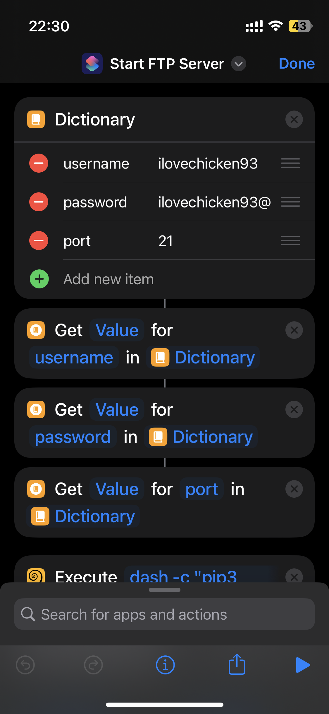

# iphone-ftp-server
`iphone-ftp-server`(ios-ftp-server) is an FTP server utilizing the "Shortcuts" App and the "a-Shell" App, allowing you to access and upload files on your iPhone from anywhere. Simple, efficient, and no additional software or fees required.
## Usage
### 1. Install the "a-Shell" App
Search for "a-Shell" in the iPhone App Store or download it via this link:
[Download Link](https://holzschu.github.io/a-Shell_iOS/)
### 2. Install the "Shortcuts" App
Search for "Shortcuts" in the iPhone App Store.
### 3. Import the "iphone-ftp-server" Shortcut
Click the link below to import the shortcut:
[Import Link](https://www.icloud.com/shortcuts/d81c30ed80fe4fc2a0c180074da7966a)
### 4. Run the "iphone-ftp-server" Shortcut
The default username, password, and port are as follows:
```
Username:ilovechicken93
Password:ilovechicken93@
Port:21
```
You can modify these configurations through the Shortcuts app.  
After a successful connection, **the root directory is the “a-Shell” folder** within the local files. Due to permission restrictions, it is not possible to modify or access higher-level directories.
*****

